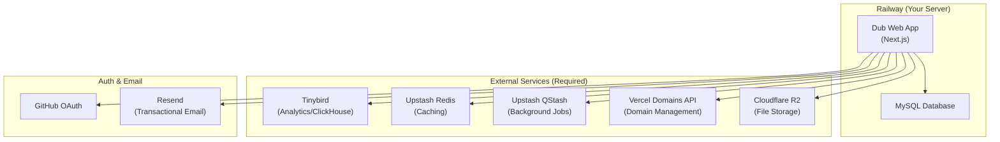

# 🚀 Deploying Dub.co on Railway — Complete Guide

> A step-by-step guide to deploy the Dub.co open-source link attribution platform on Railway, even if you have zero deployment experience.

---

## 📋 What's in This Template

| File | Purpose |
|------|---------|
| `Dockerfile` | Multi-stage Docker build for the Dub monorepo |
| `railway.toml` | Railway config-as-code (build & deploy settings) |
| `.env.railway` | Complete environment variable template with docs |
| `setup-railway.sh` | One-click setup script to prepare your repo |
| `DEPLOYMENT_GUIDE.md` | This guide |

---

## 🧩 Understanding the Architecture

Dub is a **pnpm monorepo** with this structure:

```
dub/
├── apps/
│   └── web/           ← 🎯 This is what we deploy (Next.js app)
├── packages/
│   ├── email/         ← Email templates
│   ├── tinybird/      ← Analytics schemas
│   ├── ui/            ← Shared UI components
│   └── utils/         ← Shared utilities
├── package.json       ← Root workspace config
├── pnpm-workspace.yaml
└── turbo.json         ← Turborepo build config
```

> [!IMPORTANT]
> The reason Railway deployment is tricky is because **Dub is a shared monorepo** — the `apps/web` app depends on code from `packages/*`. You can't just deploy the `apps/web` folder alone. The entire repo must be available at build time.

### Services Dub Depends On



> [!WARNING]
> Dub currently **requires** these external services. You cannot run it with just Railway. The good news: most have **free tiers** that work for small-to-medium deployments.

---

## 📝 Prerequisites Checklist

Before you start, create accounts on these services:

- [ ] **Railway** account — [railway.com](https://railway.com) (the hosting platform)
- [ ] **GitHub** account — [github.com](https://github.com) (code hosting + OAuth login)
- [ ] **Tinybird** account — [tinybird.co](https://tinybird.co) (free tier available — analytics)
- [ ] **Upstash** account — [upstash.com](https://upstash.com) (free tier available — Redis & QStash)
- [ ] **Cloudflare** account — [cloudflare.com](https://cloudflare.com) (R2 file storage)
- [ ] **Resend** account — [resend.com](https://resend.com) (optional — for email sign-in)
- [ ] **Vercel** account — [vercel.com](https://vercel.com) (required for Domains API only)
- [ ] A **custom domain** for your Dub instance (e.g., `acme.com`)
- [ ] Optionally, a **short domain** for links (e.g., `ac.me`)

---

## 🔧 Step-by-Step Deployment

### Step 1: Fork & Clone the Repository

```bash
# Fork the repo on GitHub first, then clone YOUR fork:
git clone https://github.com/YOUR_USERNAME/dub.git
cd dub
```

### Step 2: Run the Setup Script

Copy all the template files into your cloned Dub repo, then run:

```bash
# Copy template files to your Dub repo root
cp /path/to/dub-railway-deploy/Dockerfile ./Dockerfile
cp /path/to/dub-railway-deploy/railway.toml ./railway.toml
cp /path/to/dub-railway-deploy/setup-railway.sh ./setup-railway.sh

# Run the setup script
bash setup-railway.sh
```

This will:
- ✅ Create the Dockerfile and railway.toml
- ✅ Remove Vercel-specific files (`vercel.json`)
- ✅ Generate secrets for you
- ✅ Tell you what else needs to be done

### Step 3: Enable Next.js Standalone Output

> [!IMPORTANT]
> This is the **most critical step**. Without this, Railway cannot run your app.

Open `apps/web/next.config.ts` and add `output: "standalone"` to the config:

```diff
 const nextConfig = {
+  output: "standalone",
   reactStrictMode: false,
   // ... rest of the config
 };
```

> [!TIP]
> Search for `const nextConfig` or `module.exports` in the file and add the `output: "standalone"` line inside the object.

### Step 4: Set Up External Services

#### 4a. Tinybird (Analytics Database)

1. Go to [tinybird.co](https://tinybird.co) → Create a new **Workspace**
2. Copy your **admin Auth Token** → save as `TINYBIRD_API_KEY`
3. In your Dub repo, go to `packages/tinybird/`:
   ```bash
   cd packages/tinybird
   pip install tinybird-cli    # Requires Python 3.8+
   tb login                    # Paste your admin token
   tb deploy                   # Creates all data sources
   ```
4. Note the API base URL from the output (e.g., `https://api.us-east.tinybird.co`) → save as `TINYBIRD_API_URL`

#### 4b. Upstash (Redis + QStash)

1. Go to [console.upstash.com](https://console.upstash.com/) → Create a new **Redis database**
   - Recommendation: Global database with read replicas for performance
2. Copy from **REST API** section:
   - `UPSTASH_REDIS_REST_URL`
   - `UPSTASH_REDIS_REST_TOKEN`
3. Go to the **QStash** tab → Copy:
   - `QSTASH_TOKEN`
   - `QSTASH_CURRENT_SIGNING_KEY`
   - `QSTASH_NEXT_SIGNING_KEY`

#### 4c. GitHub OAuth (Login)

1. Go to [github.com/settings/applications/new](https://github.com/settings/applications/new)
2. Set callback URLs:
   - `https://YOUR_RAILWAY_DOMAIN/api/auth/callback/github`
   - `http://localhost:8888/api/auth/callback/github` (for local dev)
3. Copy `Client ID` → `GITHUB_CLIENT_ID`
4. Copy `Client Secret` → `GITHUB_CLIENT_SECRET`

#### 4d. Cloudflare R2 (File Storage)

1. Go to [Cloudflare dashboard](https://dash.cloudflare.com/) → R2 → **Create bucket** (e.g., `dubassets`)
2. Go to **Manage R2 API Tokens** → **Create API Token**
   - Permission: "Object Read & Write"
   - Scope: Your bucket only
3. Save:
   - Access Key ID → `STORAGE_ACCESS_KEY_ID`
   - Secret Access Key → `STORAGE_SECRET_ACCESS_KEY`
   - S3 API endpoint → `STORAGE_ENDPOINT`
4. Set up a public domain for the bucket → `STORAGE_BASE_URL`

#### 4e. Vercel Domains API

> Even though we're hosting on Railway, Dub uses Vercel's API to programmatically manage custom domains for short links.

1. Go to your [Vercel dashboard](https://vercel.com) → Create a team (or use existing)
2. Copy your **Team ID** → `TEAM_ID_VERCEL`
3. Create a [Vercel API token](https://vercel.com/account/tokens) → `VERCEL_API_KEY`

#### 4f. Resend (Optional — Email)

1. Go to [resend.com/api-keys](https://resend.com/api-keys) → Create API key
2. Copy → `RESEND_API_KEY`
3. Verify your domain following [Resend's guide](https://resend.com/docs/dashboard/domains/introduction)

### Step 5: Create Railway Project

1. Go to [railway.com/new](https://railway.com/new)
2. Click **"Deploy from GitHub Repo"**
3. Select your forked Dub repository
4. Railway will detect the monorepo — it may try to create multiple services

> [!IMPORTANT]
> **For the monorepo**: Railway may auto-detect the workspace. If it creates multiple services, you only need the **web** service. Delete any others.
> 
> If Railway doesn't detect correctly, click on the service → **Settings** → and ensure:
> - **Root Directory**: Leave empty (not `apps/web` — the Dockerfile handles this)
> - **Builder**: Docker

### Step 6: Add MySQL Database

1. In your Railway project, click **"+ New"** → **"Database"** → **"MySQL"**
2. Railway automatically creates the database and provides connection variables
3. Click on the MySQL service → **Variables** tab → note these auto-generated variables:
   - `MYSQLHOST`
   - `MYSQLPORT`
   - `MYSQLUSER`
   - `MYSQLPASSWORD`
   - `MYSQLDATABASE`
   - `MYSQL_URL`

### Step 7: Configure Environment Variables

1. Click on your **web app service** → **Variables** tab
2. Add **all** the environment variables from `.env.railway`

Here's the critical variables with Railway-specific syntax:

```bash
# Database (references Railway MySQL service)
DATABASE_URL=mysql://${{MySQL.MYSQLUSER}}:${{MySQL.MYSQLPASSWORD}}@${{MySQL.MYSQLHOST}}:${{MySQL.MYSQLPORT}}/${{MySQL.MYSQLDATABASE}}

# App config
NEXTAUTH_URL=https://${{RAILWAY_PUBLIC_DOMAIN}}
PORT=3000
HOSTNAME=0.0.0.0
NODE_ENV=production

# Generated secrets (paste the values from Step 2)
NEXTAUTH_SECRET=<your-generated-secret>
CRON_SECRET=<your-generated-secret>
ENCRYPTION_KEY=<your-generated-secret>

# All external service variables from Step 4
TINYBIRD_API_KEY=<from-step-4a>
TINYBIRD_API_URL=<from-step-4a>
UPSTASH_REDIS_REST_URL=<from-step-4b>
UPSTASH_REDIS_REST_TOKEN=<from-step-4b>
QSTASH_URL=https://qstash-us-east-1.upstash.io
QSTASH_TOKEN=<from-step-4b>
QSTASH_CURRENT_SIGNING_KEY=<from-step-4b>
QSTASH_NEXT_SIGNING_KEY=<from-step-4b>
GITHUB_CLIENT_ID=<from-step-4c>
GITHUB_CLIENT_SECRET=<from-step-4c>
STORAGE_ACCESS_KEY_ID=<from-step-4d>
STORAGE_SECRET_ACCESS_KEY=<from-step-4d>
STORAGE_ENDPOINT=<from-step-4d>
STORAGE_BASE_URL=<from-step-4d>
TEAM_ID_VERCEL=<from-step-4e>
VERCEL_API_KEY=<from-step-4e>
```

> [!TIP]
> **Railway Variable References**: The `${{MySQL.VARIABLE_NAME}}` syntax automatically resolves to the MySQL service's variables. This means if you redeploy or change the database, the connection string updates automatically.

### Step 8: Push Schema to Database

After your Railway MySQL is running, you need to create the database tables:

**Option A: Via Railway CLI (Recommended)**

```bash
# Install Railway CLI
npm install -g @railway/cli

# Login
railway login

# Link to your project
railway link

# Run Prisma push via Railway (this runs it with the correct DATABASE_URL)
railway run pnpm --filter web prisma:push
```

**Option B: Via Railway Shell**

1. In Railway, click on your web service → **Settings** → **Deploy** section
2. Before the first deploy, temporarily set the start command to:
   ```
   cd apps/web && pnpm run prisma:push && node .next/standalone/apps/web/server.js
   ```
3. After the first successful deploy, change it back to just:
   ```
   node apps/web/.next/standalone/apps/web/server.js
   ```

### Step 9: Deploy

1. **Commit and push** your changes:
   ```bash
   git add .
   git commit -m "feat: add Railway deployment config"
   git push origin main
   ```

2. Railway will **automatically detect the push** and start building
3. Watch the build logs in Railway dashboard
4. Once deployed, your app will be available at the Railway-provided URL

### Step 10: Set Up Custom Domain (Optional)

1. In Railway, click on your web service → **Settings** → **Networking**
2. Add your custom domain (e.g., `app.acme.com`)
3. Railway will show you the DNS records to add
4. Update `NEXTAUTH_URL` environment variable to your custom domain

---

## 🐛 Troubleshooting

### Build fails with "Module not found"

This usually means the Dockerfile isn't copying all necessary packages. Check that:
- All `packages/*` directories are being copied in the deps stage
- `pnpm-workspace.yaml` is present

### "The table X does not exist"

The database schema hasn't been pushed. Run:
```bash
railway run pnpm --filter web prisma:push
```

### "NEXTAUTH_URL mismatch"

Make sure `NEXTAUTH_URL` matches your actual deployed URL exactly (including `https://`).

### Build runs out of memory

In Railway settings, increase the builder memory limit. Dub's build can require 2-4GB RAM.

### Prisma client not generated

The Dockerfile handles this, but if you're getting Prisma errors, ensure the `prisma:generate` step runs before `build` in the Dockerfile.

### "Connection refused" to MySQL

Ensure you're using Railway's internal networking. The `DATABASE_URL` should use the **private** host (the `${{MySQL.MYSQLHOST}}` variable resolves to the internal hostname).

---

## 💰 Cost Estimates

| Service | Free Tier | Paid Estimate |
|---------|-----------|---------------|
| Railway (App + MySQL) | $5 trial credit | ~$10-20/month |
| Upstash Redis | 10K commands/day free | ~$0-10/month |
| Upstash QStash | 500 messages/day free | ~$0-10/month |
| Tinybird | 1M rows/month free | ~$0-30/month |
| Cloudflare R2 | 10GB free | ~$0-5/month |
| Vercel (API only) | Free tier works | $0 |
| Resend | 3K emails/month free | $0 |
| **Total** | **~$5-10/month** | **~$15-75/month** |

---

## ⚠️ Important Caveats

> [!CAUTION]
> 1. **Vercel Edge Middleware**: Dub uses Next.js middleware for link redirects. On Railway, this runs as Node.js middleware (not at the edge). This means redirects may be slightly slower than on Vercel but still works.
>
> 2. **Vercel Domains API**: Even on Railway, Dub still calls Vercel's API to manage custom domains programmatically. You need a Vercel account for this.
>
> 3. **No Docker Compose**: This template uses Railway's native service orchestration rather than Docker Compose. Each service (app, database) runs independently.
>
> 4. **PlanetScale Adapter**: Dub uses `@prisma/adapter-planetscale` which uses PlanetScale's HTTP-based protocol. If you're using Railway's standard MySQL, you may need to modify the Prisma configuration to use the standard MySQL adapter instead. See the section below.

### Using Railway MySQL Instead of PlanetScale

If you want to use Railway's MySQL instead of PlanetScale, you'll need to modify Dub's Prisma setup:

1. In `apps/web/prisma/schema/schema.prisma`, change the datasource:
   ```diff
    datasource db {
   -  provider     = "mysql"
   -  url          = env("DATABASE_URL")
   -  relationMode = "prisma"
   +  provider = "mysql"
   +  url      = env("DATABASE_URL")
    }
   ```

2. Remove the PlanetScale adapter usage from the Prisma client initialization code (usually in `apps/web/lib/prisma.ts` or similar).

3. You won't need `PLANETSCALE_DATABASE_URL` — just `DATABASE_URL` pointing to Railway MySQL.

> [!NOTE]
> Using standard MySQL means you'll get proper foreign key constraints, which is actually better than PlanetScale's `relationMode: "prisma"`. However, some queries may behave differently.

---

## 🔄 Updating Dub

To update to the latest version of Dub:

```bash
# Add upstream remote (one-time)
git remote add upstream https://github.com/dubinc/dub.git

# Fetch latest changes
git fetch upstream

# Merge (resolve any conflicts with your Railway config)
git merge upstream/main

# Push to trigger Railway redeploy
git push origin main
```

After updating, you may need to run database migrations:
```bash
railway run pnpm --filter web prisma:push
```

---

## 📂 File Placement Summary

After setup, your repo root should look like:

```
dub/
├── Dockerfile           ← NEW (multi-stage build)
├── railway.toml         ← NEW (Railway config)
├── apps/
│   └── web/
│       ├── next.config.ts  ← MODIFIED (added output: "standalone")
│       └── ...
├── packages/
│   └── ...
├── package.json
├── pnpm-workspace.yaml
└── turbo.json
```

---

*Template created for deploying [dubinc/dub](https://github.com/dubinc/dub) on Railway. Last updated: July 2026.*
